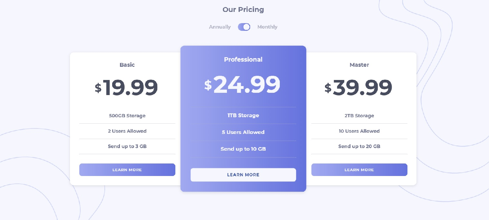

# Frontend Mentor - Pricing component with toggle solution

This is a solution to the [Pricing component with toggle challenge on Frontend Mentor](https://www.frontendmentor.io/challenges/pricing-component-with-toggle-8vPwRMIC). Frontend Mentor challenges help you improve your coding skills by building realistic projects.

## Table of contents

- [Overview](#overview)
  - [The challenge](#the-challenge)
  - [Screenshot](#screenshot)
  - [Links](#links)
- [My process](#my-process)
  - [Built with](#built-with)
  - [What I learned](#what-i-learned)
  - [Continued development](#continued-development)
  - [Useful resources](#useful-resources)
- [Author](#author)
- [Acknowledgments](#acknowledgments)

## Overview

### The challenge

Users should be able to:

- View the optimal layout for the component depending on their device's screen size
- Control the toggle with both their mouse/trackpad and their keyboard

### Screenshot

### Links

- Solution URL: [Github Repo](https://github.com/Barbelitos/FrontEndMentor-PricingComponent)
- Live Site URL: [Pricing Component](https://barbelitos.github.io/FrontEndMentor-PricingComponent/)

## My process

### Built with

- HTML5
- CSS
- Flexbox
- Mobile-first workflow
- JavaScript
- DOM

### What I learned

Learned how to create a toggle switch from a checkbox input.

### Continued development

Continue developing CSS skills and learning new and cleaner ways of implementing it

### Useful resources

- [Create a toggle switch W3Schools](https://www.w3schools.com/howto/howto_css_switch.asp) - I have used this resource from w3schools to help build the toggle switch from a checkbox input.

## Author

- Github - [Barbelitos](https://github.com/Barbelitos)
- Frontend Mentor - [@Barbelitos](https://www.frontendmentor.io/profile/Barbelitos)

## Acknowledgments
